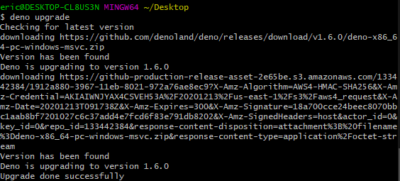

# 程式碼編譯器

### 前置作業

在開始之前，請確保你的 Deno 版本為 `1.6.0` 以上。



### 進入正題

更新到最新版本後，我們一樣將畫面停留在命令列並輸入:

```text
deno compile --unstable https://deno.land/std@0.79.0/http/file_server.ts
```

這時，只要靜靜等待編譯完即可。

編譯完成後，我們會看到如下圖右方的訊息:

```text
// ...
Emit file_server
```

接著，我們可以執行該檔案，便會順利看到下圖左方的畫面:

```text
./file_server.exe
```


